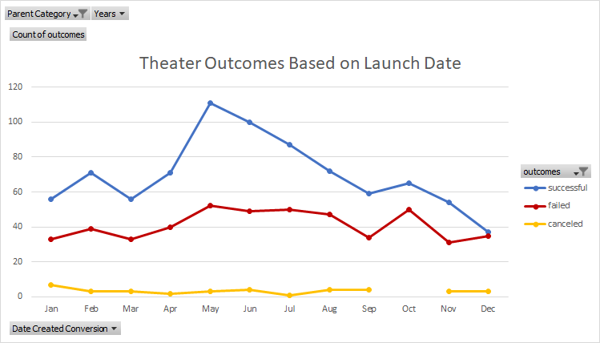
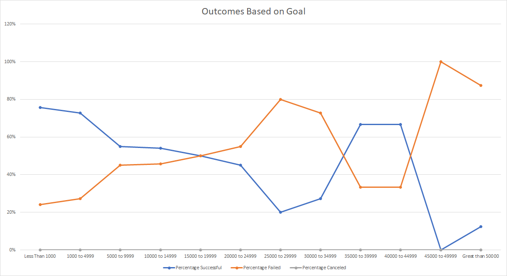
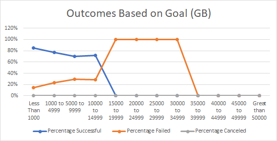
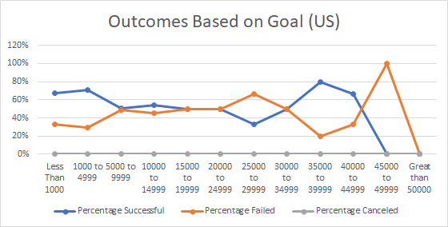
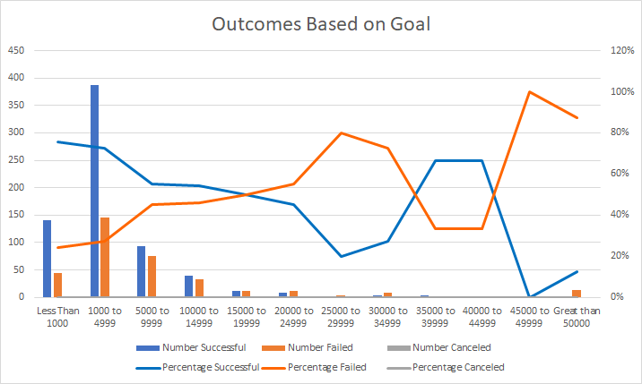

# kickstarter-analysis
Week 1 Challenge - Kickstarter

## Overview of Project
  The playwriter, Louise needs some advice to arrange a crowdfunding campaign to fund her coming play, fever, $10K budget. The project focus on using excel to conduct an analysis by existing site data to see if campaigns launch dates and goal amount are specific factors to determine if fund-raising would be likely to succeed. The analysis should offer Louise some guidelines on launch date and goal to arrange her campaign.
  
## Analysis and Challenges
  Louise is look for funding for a play. Although, there are 4,113 campaigns records in existing site data, there are only 1,369 records are related to campaigns for theater which play is a subcategory belonged to. Therefore, the first analysis is based on the 1,369 records of theater campaigns to draw a line chart to see if campaigns outcome has any pattern between campaigns launched in different month. Then, in theater campaign records, there are three types of subcategory, plays, musical, and spaces.  Using the 1,047 plays-related campaigns records to make a statistical table to summarize the calculation for successful, failed and cancelled percentage base on different goal amount break. It is to see if outcome of plays campaigns has any trend in different goal amount.
  While in analyzing, the most challenges are how to convert the raw data into the data we want to use. Fortunately, excel provides many formulas to extract data, such as countifs. While making statistics table on plays campaigns, formula of countifs is very useful. As long as, the criteria is defined such as goal amount range break and outcome, excel will count according to criteria for us. By the way, I input the amount break into the cells so than the formula could be used by pulling down hair cross instead of inputting one by one.  
  
## Result
### Analysis of Outcomes Based on Launch Date
  During 2009 to 2017, there are total 1,369 campaign records, and 839 compaigns are successful, 493 are failed, and 37 are canceled. From the pivot table chart, it can be concluded that most successful campaigns are held in May, Jun, Jul, Aug, and Oct and especially in May.
  

### Analysis of Outcomes Based on Goals
  The line chart displays that 50% of campaign could be succeeded while the goal amount between $15,000 to $19,999. It is more likely to succeed while the goal amount is less than $15,000 since successful percentage is more than 50%. It is more likely to be failed while the goal amount is higher than $19,999 since successful percentage is less than 50%. However, while the goal amount exceeds $35,000 and is less $44,999, successful percentage is more than 50% a gain. And while the goal amount is more than $45,000, the successful percentage is merely 0% and 13%.

### Limitations of this dataset
   1.Since we try to drag a conclusion based on the existing data on hand, it is necessary to use the most updated data. It is 2021 now but the data only included till year of  2017. The market might have a different preference during these 4 years. Our conclusion could only delivery that before 2017, the most successful campaigns were held in May, Jun, Jul, Aug, and Oct and especially in May. It is most likely to succeed to fund $10,000 according to the trend.

  2.Another factor not considered is that country. Louise did not point out that where is she going to do the campaign. Different conclusion could be made since the goal amount has different successfully percentage in different country. Please see Chart 1 and Chart 2 below. Chart 1 is data in GB, there is no campaigns successfully for goal amount over $14,999. On the other hand, Chart 2 providing data in US, the successful percentage fluctuates according to different goal amount and it is difficult to conclude that there is any trend between goal amount and outcome.  

  3.Finally, we should not ignore the spread of campaign data in each goal amount range. Please see the Chart 3 below, you can see out of 1,047 campaign, the most goal amount are in the first three range between $1,000 to $9,999 and the trend shows that it is more likely to be succeeded than failed. Louise's estimated goal amount falls on the range of $10,000 to $14,999 which is not the most common group and the successful percentage is 54%.

###  Other possible tables and/or graphs that we could create
Chart 1

Chart 2

Chart 3

